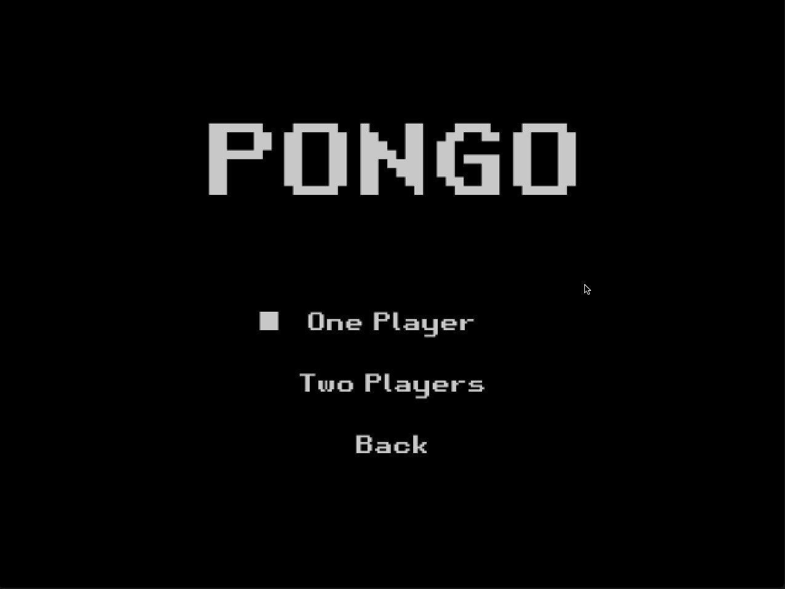

<h1 align="center"> PONGO SERVER </h1>

<p align="center">
  <a href="" rel="noopener">
 </a>
</p>

## 📝 Table of Contents

- [📕 Features](#features)
- [</> Architecture Overview](#architecture)
- [🎈 Game Design Considerations](#game-design)
- [🔧 Installations](#installation)
- [💻 Usage](#usage)
- [💡 Contributing](#contibuting)

Pongo Multiplayer Server is a Go implementation of the classic Pong game server, supporting real-time multiplayer gameplay. 

The server computes player and ball positions and communicates with clients over WebSockets. 

It's designed to be agnostic to graphics libraries, focusing solely on the game logic and physics calculations.

## 📕 Features <a name = "features"></a>
- WebSocket-based multiplayer server for the classic Pong game.
- Matchmaking system to pair players for games.
- Graphics-agnostic design;
- Real-time gameplay support between two players.
- Spectator (live-streaming) mode allowing clients to watch ongoing matches.
- Latency measurement and ping handling.
- Session management for active game sessions.

## </> Architecture Overview <a name = "architecture"></a>

The server is structured into several internal packages to maintain clean code organization and separation of concerns:

- internal/httpserver: Handles HTTP server setup, routes, and graceful shutdown.
    - It includes three routes: /multiplayer for players WebSocket connections, /sessions for listing active game sessions, and /spectator for spectators WebSocket connections
- internal/ws: Manages WebSocket connections for players and spectators, including upgrading HTTP requests and handling messages.
    - Includes handlers for latency measurement and connection closing.
- internal/game: Contains game logic, including player and ball physics, game sessions, and state management.
    - It includes the game loop, input processing, and game state broadcasting.
- internal/matchmaking: Implements the player pool and matchmaking logic to pair players for new games.
    - It continuously checks the player pool at each player connection to initiate new game sessions.

## 🎈 Game Design Considerations <a name = "game-design"></a>
- Shared Engine Logic: The server and client share the same game engine logic from the pkg directory of the pong-multiplayer-go project, ensuring consistency in physics calculations.
- Fixed Time Step Loop: The game loop runs on a fixed time step using a ticker, at 60 frames per second.
- Input Processing: Player inputs are queued and processed systematically to maintain synchronization between players. There is a heavy use of channels to ensure thread safety.
- Game State Broadcasting: The server broadcasts game state updates to clients at the fixed time step, allowing clients to render the game accurately. This broadcasting can be done both for players and spectators.
- Spectator Support: The game state broadcasting enables the state of the game to be transmitted to other clients without processing inputs, allowing for spectator mode.
- Latency Handling: Regular ping/pong messages between server and clients help measure latency, allowing for network troubleshooting and gameplay adjustments.
- Session Handling: Each game session is uniquely identified, allowing for it to be listed, managed, and accessed by clients.
- Network Context and Cancellation: Each network session has a context that propagates cancellation to all derived goroutines, ensuring proper cleanup in case of disconnection, errors, server shutdown or end of the game session.


## 🔧 Installation <a name = "installation"></a>
To set up the Pongo Multiplayer Server locally, follow these steps:

### Clone the repository:

```bash
git clone https://github.com/reneepc/pongo-server.git
cd pongo-server
```
### Build the server:

```bash
make build-server
```

This command compiles the server and places the binary in the ./build directory.

## 💻 Usage <a name = "usage"></a>
### Running the Server
To run the server locally without building:

```bash
make run-server
```

Alternatively, run the built binary:

```bash
./build/pongo-server
```

### Connecting a Client
The server is intended to be used with the client implementation available at [Pong Multiplayer Go](https://github.com/gandarez/pong-multiplayer-go). The client utilizes the shared engine logic from the pkg directory to ensure consistent game physics between the client and server.

A mock client is available in the mock directory for testing purposes:

```bash
make run-client
```

This will run a mock client that connects to the server and simulates a player's actions.

## 💡 Contributing <a name = "contributing"></a>
Contributions are welcome! Please fork the repository and submit a pull request for any enhancements or bug fixes.

